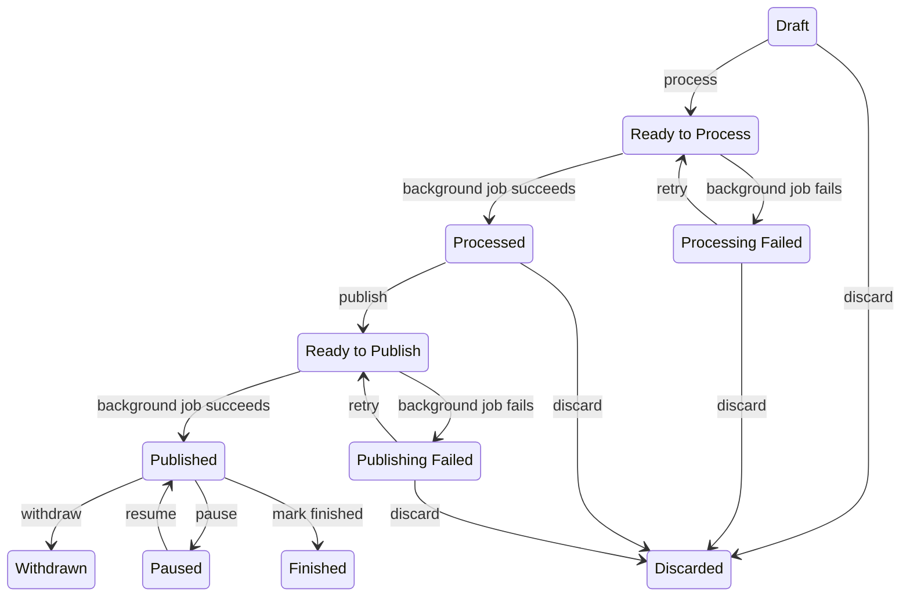

# Projects

Any Missing Maps member can request a MapSwipe project. If you want to add a new project but aren't sure how, reach out to the MapSwipe community on Slack first.

All projects are listed on the **Project** page of the [Manager Dashboard](https://managers.mapswipe.org). Managers can filter the list and expand each entry with the **Show details** button to inspect a project.

## Creating a Project

To set up a new project, sign in to the [Manager Dashboard](https://managers.mapswipe.org) with your MapSwipe account. You'll need dedicated *project manager credentials* — reach out to the MapSwipe community if you don't have them yet. Once signed in, you'll see a home screen similar to the one below.

Go to the **Project** page and press the **New Project** button to open the *Create a New Project* form.

At a glance, the end-to-end flow looks like:

1. Create the project up to the `Draft` stage and save it.
   
2. Create a tutorial for the project, picking the new project as the reference project type. The tutorial pre-fills its AOI from the project.
   
3. Complete the rest of the tutorial.
   
4. Return to the project (now in at least the `Processed` stage), attach the tutorial, and publish.
   

## Creating a Project in Detail

### Initialize

*Get started with the basic details of the project.*

- Select a **project type**.
- Populate the fields under the **General** section.
- Click **Save Draft** to save the project in the `Draft` state.
- You can return to the draft at any time to continue creating the project.

### Draft

*Update the basic and project-type-specific details. You can update most of the fields during this stage.*

- The **General** information is already populated from the previous stage.
    - You can edit it as needed; however, the project type is locked at this stage.
- Fields under the **Additional** section come with default values that can be edited.
    - Upload a project cover image, or the default cover for the project type will be used.
- Fill in the **Project type specific details** section. The form changes per project type — see the [Project Types](../project_types.md) docs for each type's exact fields.
- Save the project.
- Once saved, submit the project for processing to move to the next stage.

### Processing

*The project is being processed to create tasks, groups, and other necessary information. This might take a while depending on the inputs you've provided.*

### Processed

*The project has been processed successfully — add a tutorial and proceed to publish.*

- The **General**, **Additional**, and **Project type specific details** sections are now populated.
    - You can update the general information and the project cover image.
- Attach a tutorial of the matching project type from the list of options.
    - If no suitable tutorial exists, or the project needs a custom tutorial, [create the tutorial first](./tutorials.md#creating-a-tutorial) and come back to continue project creation.
- Save the updated project, then publish it.

### Publishing

*The project is being published to Firebase. Once completed, users will be able to contribute to it.*

### Published

*The project is published and available to users for swiping.*

Once published, the project appears on the Manager Dashboard and in the mobile and web apps for contributors to begin mapping. A project notification is also posted to the [mapswipe-projects-notifications](https://mapswipe.slack.com/archives/C09L064N77G) Slack channel, with subsequent updates following in that message's thread; important updates are mirrored to the channel itself.

## Important notes when creating a project

General things to watch out for while creating a project:

- Make sure the project name is clear.
- The default verification count is `3` — the progress algorithm assumes that baseline. Fewer people looking at each task reduces data quality; the best results we've seen come from a 5-person verification.
- Re-read, correct, and improve the description that came with the request.
- Check the cover image format and size (max 1 MB); it's used as the project thumbnail.
- Check the available satellite imagery for the area; good imagery is essential to keep a project going. If the imagery is unusable (poor resolution, cloud cover, etc.), adjust the area. Zoom to level 18 to inspect it.

### Maximum allowed area for a project

Each project type has its own maximum area of interest (AOI).

#### Find Features

The maximum AOI size depends on the project's zoom level, calculated by the formula `5 * (4 ** (23 - zoom_level))` sq km. Supported zoom levels range from `14` to `23`:

| Zoom level | Max AOI area (sq km)         |
|-----------:|-----------------------------:|
| `14`       | `1,310,720` (≈ size of Peru) |
| `15`       | `327,680`                    |
| `16`       | `81,920`                     |
| `17`       | `20,480`                     |
| `18`       | `5,120`                      |
| `19`       | `1,280`                      |
| `20`       | `320`                        |
| `21`       | `80`                         |
| `22`       | `20`                         |
| `23`       | `5`                          |

At zoom level `14`, the maximum (`1,310,720` sq km) corresponds to the `MAX_AOI_GEOMETRY_AREA` constant in the backend.

The AOI GeoJSON must be a flat polygon. If your input exceeds the maximum for the chosen zoom level, split it into smaller pieces and create one project per piece — use [geojson.io](https://geojson.io) or QGIS to inspect or convert geometries.

#### Validate Footprints

The maximum AOI size is `2,500` sq km. This applies to all three creation methods: GeoJSON upload, GeoJSON external link, and HOT Tasking Manager ID (TMID).

The GeoJSON file should contain only simple polygons. Complex multi-polygon geometries (such as [polygons with holes](https://developers.google.com/maps/documentation/javascript/examples/polygon-hole)) are not supported.

#### Compare Dates

Same maximum AOI size and GeoJSON rules as [Find Features](#find-features).

#### Check Completeness

Same maximum AOI size and GeoJSON rules as [Find Features](#find-features).

#### View Streets

The maximum AOI size is `20` sq km.

The GeoJSON file should contain only simple polygons. Complex multi-polygon geometries (such as [polygons with holes](https://developers.google.com/maps/documentation/javascript/examples/polygon-hole)) are not supported.

## Editing a Project

Project managers can edit a project's basic details, listed below. The area-of-interest GeoJSON is locked once processed and cannot be changed.

> [!NOTE]
> The project must be paused before any edits can be made.

- Project topic
- Additional info URL
- Project description
- Project image
- Project instruction
- Look for (legacy field)
- Project number
- Project region
- Tutorial used

## Pausing and Resuming a Project

A published project can be **paused** to temporarily stop accepting contributions — paused projects don't appear in the MapSwipe app. Pausing is also required before editing a project. A paused project can be **resumed** back to `Published` at any time.

## Withdrawing a Project

A published project can be **withdrawn** when it should be permanently retracted from the app. `Withdrawn` is a terminal status — once withdrawn, the project cannot leave it.

## Finishing a Project

A published project can be marked as **finished** by a manager at any time, regardless of progress percentage. `Finished` is a terminal status — once finished, the project cannot leave it.

## Discarding a Project

Discarding retires a project that has not yet reached `Published`. It's available while the project is still in `Draft` or `Processed`, or after a failed processing or publishing attempt (`Processing Failed`, `Publishing Failed`). Once a project is published, use **Withdraw** instead.

## Status flow

Every project moves through one of the following statuses:

| Status              | Meaning                                                                                                              |
|---------------------|----------------------------------------------------------------------------------------------------------------------|
| `Draft`             | Creation has begun; the manager has saved the initial form but has not yet submitted the project for processing.     |
| `Ready to Process`  | The project is queued for the background job that validates and tiles the GeoJSON.                                   |
| `Processing Failed` | Background processing did not complete; the project can be retried or discarded.                                     |
| `Processed`         | Processing finished; the manager can now attach a tutorial and submit for publishing.                                |
| `Ready to Publish`  | The project is queued for the background job that makes it available in the apps.                                    |
| `Publishing Failed` | Background publishing did not complete; the project can be retried or discarded.                                     |
| `Published`         | The project is live in the MapSwipe app and accepting mapping contributions.                                         |
| `Paused`            | A published project that is temporarily not accepting contributions; can be resumed back to `Published`.             |
| `Withdrawn`         | A published project that has been intentionally retracted from the app. Terminal.                                    |
| `Finished`          | A published project that a manager has marked as finished — at any time, regardless of progress. Terminal.           |
| `Discarded`         | The project was retired before reaching `Published`. Terminal.                                                       |

The four arrows out of `Ready to Process` and `Ready to Publish` are driven by background jobs rather than manager actions; every other arrow corresponds to a manager action taken from the dashboard.
