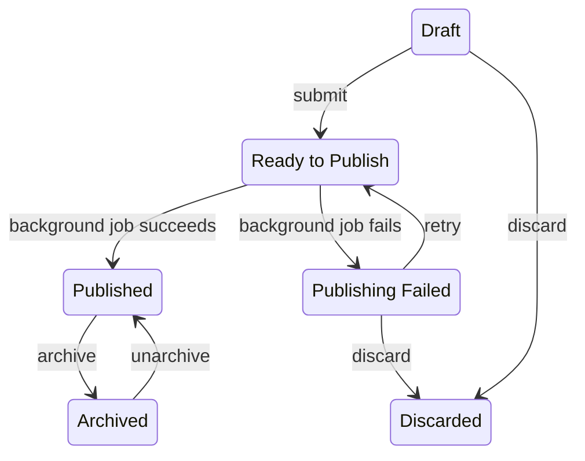

# Tutorials

A tutorial walks new contributors through what a project asks them to do.

All tutorials are listed on a dedicated page. Managers can filter the list and expand each entry with the **Show details** button to inspect a tutorial.

A tutorial is always tied to an existing reference project — its project type is derived from that project.

## Creating a Tutorial

A tutorial is tied to a reference project. The tutorial inherits its project type from that project, so the reference project must already exist.

Fill in each of the sections below in turn.

### General

- Set a clear tutorial title.
- Pick an existing reference project (any status).

### Information Pages

The introductory pages shown to contributors. At least one page is required; each page needs a `title` and one or more blocks.

### Scenario Pages

Scenario pages are populated via a JSON import. The expected format varies per project type — build the import file from the reference project's **Processed Tasks**.

Once imported, one scenario is generated per entry. For each scenario, provide `instruction`, `hint`, and `success` content (each with an icon, a title, and a description). The reference answer for every task can be adjusted from the dashboard.

### Submit

Click **Submit tutorial** to start publishing — the tutorial moves to `Ready to Publish` and is processed by a background job.

## Editing a Tutorial

Project managers can edit a tutorial's details after it has been published. The area-of-interest GeoJSON is locked once processed and cannot be changed.

## Archiving a Tutorial

A tutorial can be **archived** when it should no longer be available for new projects. Archived tutorials cannot be selected when creating or updating a project; if the tutorial is needed again, it can be moved back to `Published`.

## Discarding a Tutorial

Discarding retires a tutorial that has not yet reached `Published`. It's available while the tutorial is still in `Draft`, or after a failed publish attempt (`Publishing Failed`). Once a tutorial is published, archive it instead.

## Status flow

Every tutorial moves through one of the following statuses:

| Status              | Meaning                                                                                              |
|---------------------|------------------------------------------------------------------------------------------------------|
| `Draft`             | Creation has begun; details are still being filled in.                                               |
| `Ready to Publish`  | The tutorial is queued for the background job that processes it.                                     |
| `Publishing Failed` | Background processing did not complete; the tutorial can be retried or discarded.                    |
| `Published`         | Processing finished; the tutorial is available to attach to projects.                                |
| `Archived`          | The tutorial is hidden from the tutorial picker on projects; can be moved back to `Published`.       |
| `Discarded`         | The tutorial was retired before reaching `Published`. Terminal.                                      |

The two arrows out of `Ready to Publish` are driven by a background job rather than manager actions; every other arrow corresponds to a manager action taken from the dashboard.
